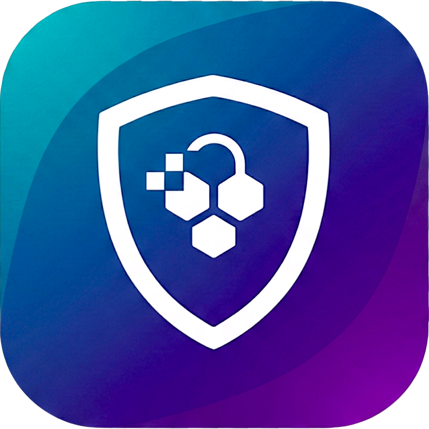
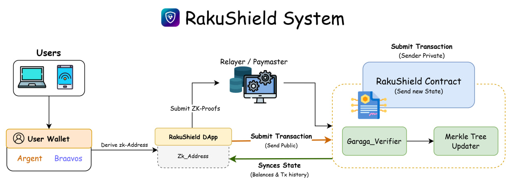
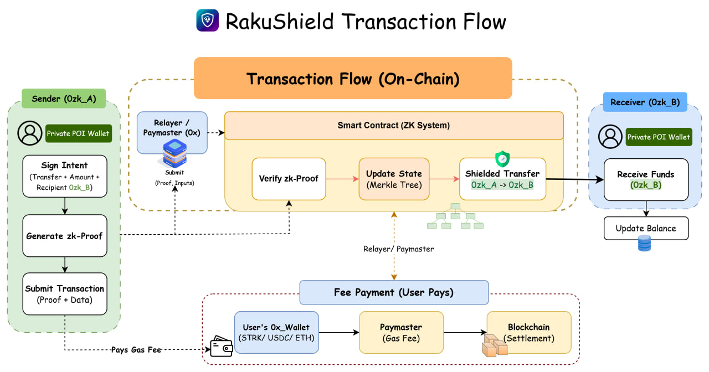

# RakuShield

Privacy-first transfer infrastructure on Starknet, built with a shielded pool, relayer service, and zero-knowledge circuits.

<p align="center">
  
</p>

Current release: `v0.1.0` (2026-02-28)

## 1) Why this project exists

Public blockchains are transparent by default. For normal users, DAOs, and teams, that means:
- wallet-to-wallet transfer history is easy to trace.
- balance and treasury movement are publicly linkable.
- operational privacy is weak for sensitive payments.

RakuFlow solves this by separating **public wallet identity** from **shielded transfer identity**, while still using Starknet security guarantees.

## 2) What RakuFlow does

RakuFlow provides a privacy-first transfer flow:
- deposit tokens from a public address into a shielded pool
- represent value as commitments and notes
- transfer privately between shielded addresses
- withdraw back to a public address when needed

Core result:
- observers can see on-chain state transitions
- observers cannot directly link sender/receiver identity inside the shielded flow

## 3) Project goals

RakuShield protects transaction privacy by separating public wallet identity from shielded transfer identity.

Core flow:
1. Deposit into shielded pool.
2. Transfer privately via commitments/notes.
3. Withdraw back to a public address.

## 4) Product overview (for non-dev and stakeholders)

### Key capabilities
- private transfer UX in a web app
- wallet integration (Starknet wallets)
- relayer-aware transfer flow
- shielded note lifecycle management
- deposit / transfer / withdraw transaction history views

### Typical user journey
1. Connect Starknet wallet.
2. Generate deterministic zk-keypair (shielded identity).
3. Deposit STRK/token into shielded pool.
4. Transfer privately to another shielded address.
5. Withdraw from shielded state back to public address.

### Scope status
- Focused on Starknet Sepolia for current development/release cycle.
- Structured for iterative production hardening.

## 5) Technical architecture (for developers)

### High-level Architecture

- **Frontend (`WebService/WebUser/`)**  
  React + Vite dApp UI.  
  Handles wallet connection, intent signing, zk-identity derivation, client-side proof generation (Noir), and interaction with the relayer API.

- **Backend / Relayer (`WebService/API/`)**  
  Relayer service responsible for:
  - Receiving signed intents and generated proofs
  - Performing basic validation (signature, proof format)
  - Constructing contract calldata
  - Broadcasting transactions to Starknet  
  Gas fees are paid by the relayer account (gas abstraction layer).

- **Smart Contracts (`Blockchain/Contract/`)**  
  Cairo contracts deployed on Starknet implementing:
  - ZK proof verification
  - Merkle tree commitment state management
  - Root history tracking
  - Nullifier enforcement
  - Shielded transfer and withdrawal logic

- **Zero-Knowledge Circuits (`Blockchain/Circuits/`)**  
  Noir circuits defining:
  - Ownership constraints
  - Commitment construction
  - Nullifier derivation
  - Merkle inclusion proof logic  
  Compiled artifacts are used by the client-side prover.

- **Scripts & Tooling (`Blockchain/Test/`)**  
  Integration scripts and testing utilities for:
  - Contract deployment
  - State interaction
  - Proof verification testing
  - Relayer flow simulation

### System and flow diagrams

System architecture:



Transaction flow:



## 6) Repository structure

| Path | Purpose |
| --- | --- |
| `WebService/WebUser/` | Frontend dApp (React + Vite) |
| `WebService/API/` | Relayer backend (Express + TypeScript + MongoDB) |
| `Blockchain/Contract/` | Cairo contracts |
| `Blockchain/Circuits/shielded_transfer/` | Noir circuit package |
| `Blockchain/test/` | Script-based contract interaction tests |
| `docs/` | Branching and release process documents |
| `VERSION` | Root release version source of truth |
| `CHANGELOG.md` | Structured change history |
| `RELEASE_NOTES.md` | Human-readable release summary |

## 7) Prerequisites

- Node.js 20+
- npm 10+
- Scarb
- Starknet Foundry (`snforge`, `sncast`)
- Noir (`nargo`)
- MongoDB (for API service)

## 8) Run components

### Frontend (`WebService/WebUser`)

```bash
cd WebService/WebUser
npm ci
cp .env.example .env
npm run dev
```

### API (`WebService/API`)

```bash
cd WebService/API
npm ci
npm run dev
```

### Contract (`Blockchain/Contract`)

```bash
cd Blockchain/Contract
scarb build
scarb test
```

### Circuit (`Blockchain/Circuits/shielded_transfer`)

```bash
cd Blockchain/Circuits/shielded_transfer
nargo check
```

## 9) Frontend env vars

Set in `WebService/WebUser/.env`:

- `VITE_RPC_SEPOLIA`
- `VITE_RPC_MAINNET`
- `VITE_CHAIN_ID_SEPOLIA`
- `VITE_CHAIN_ID_MAINNET`
- `VITE_SHIELDED_POOL`
- `VITE_GARAGA_VERIFIER`
- `VITE_STRK_TOKEN`
- `VITE_RELAYER_URL`

Template: `WebService/WebUser/.env.example`.

## 10) Release and branching docs

- Branching strategy: `docs/BRANCHING_STRATEGY.md`
- Release process: `docs/RELEASE_PROCESS.md`
- Release notes: `RELEASE_NOTES.md`
- Changelog: `CHANGELOG.md`

## 11) Release branch/tag for v0.1.0

Create and push release branch:

```bash
git checkout dev
git pull origin dev
git checkout -b release/v0.1.0
git push -u origin release/v0.1.0
```

After release branch is merged to `main`, create tag:

```bash
git checkout main
git pull origin main
git tag -a v0.1.0 -m "Release v0.1.0"
git push origin v0.1.0
```
